# Midterm Project

## Purpose of the Midterm

The purpose of this project is to analyze the strongest factors in determining a student's failure or success. The analysis is divided into three primary areas: department, family, and lifestyle. 

Data Source:
The data was downloaded from kaggle and can be accessed from this link: 
https://www.kaggle.com/datasets/mahmoudelhemaly/students-grading-dataset

Data Cleaning:
- Removed Student_ID Column
- Removed First_Name Column
- Removed Last_Name Column
- Removed Email Column
- Removed null values for the Parent_Education_Level column
- Created grade_int column translating letter grades to intergers

-28 February 2025

---

# DEPARTMENT & DEMOGRAPHICS:

## Gender, Age, Department Distribution

### - What is distribution of the data across gender, age, and department?

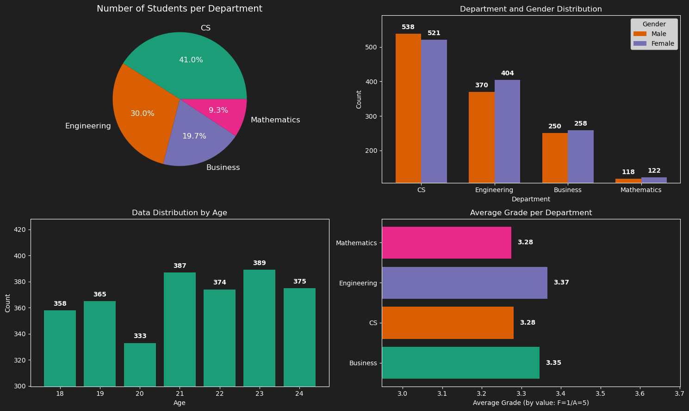

---

## Academic Performance

### - Are there any notable differences in academic performance between different departments?

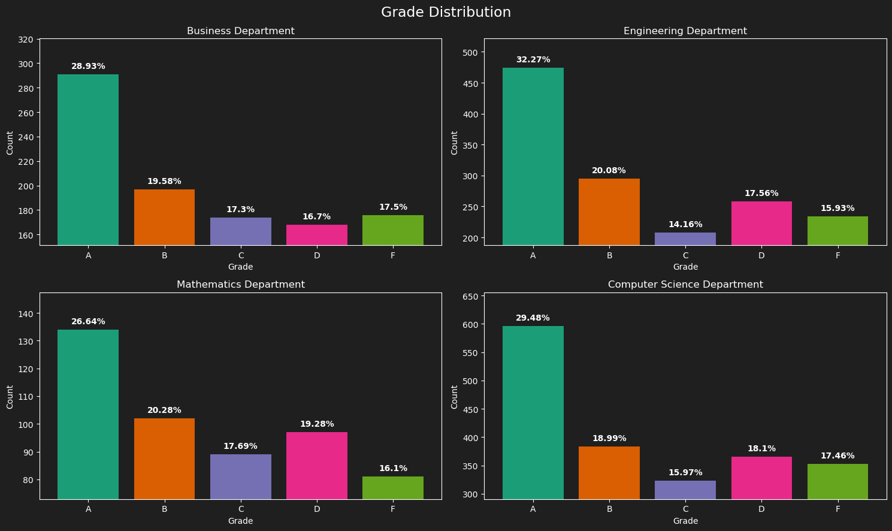
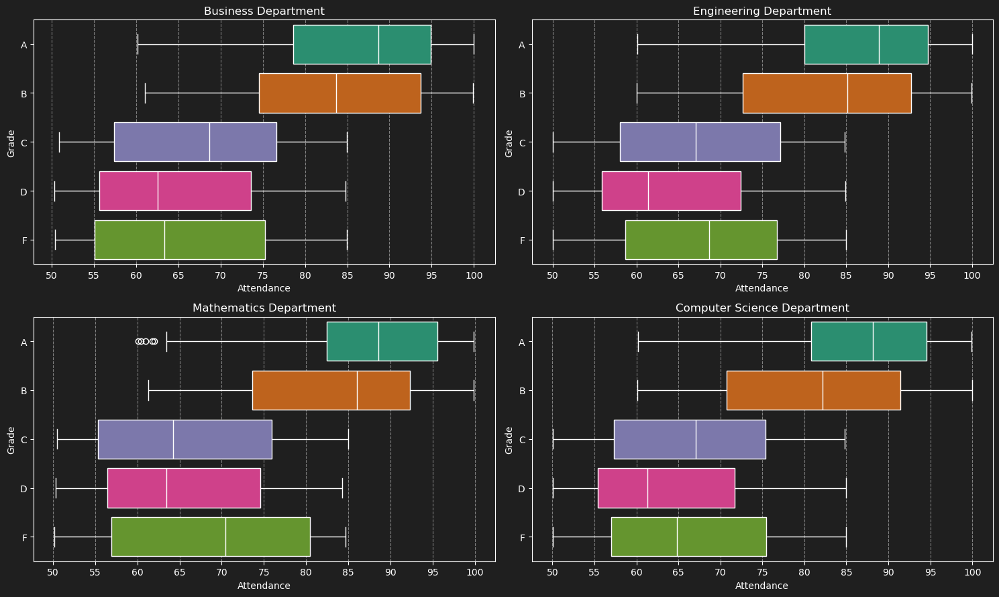

---

# Family Income and Academic Performance:

## Family Academic Effect

### - Does family education level have an impact on students' grades?

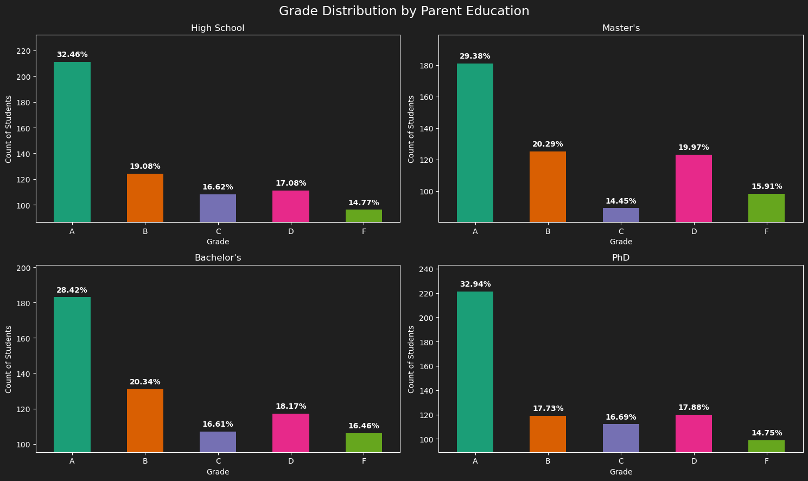
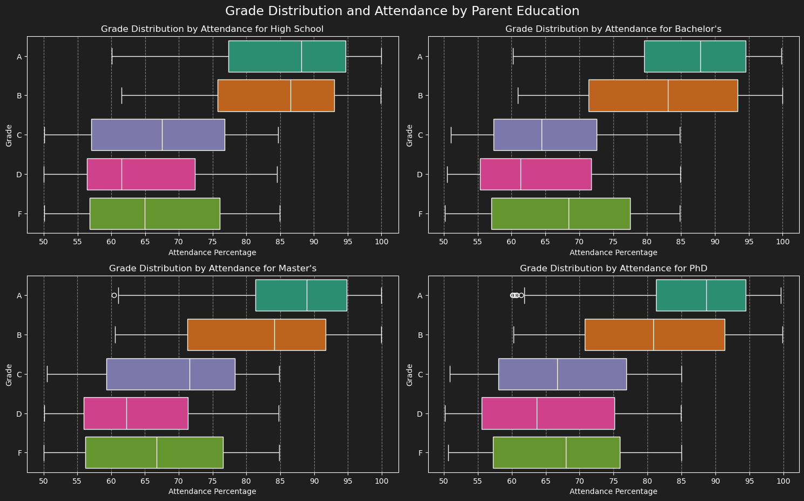

---

## Family Study Habit Effect

### - How does family income level influence students' access to educational resources and study habits?

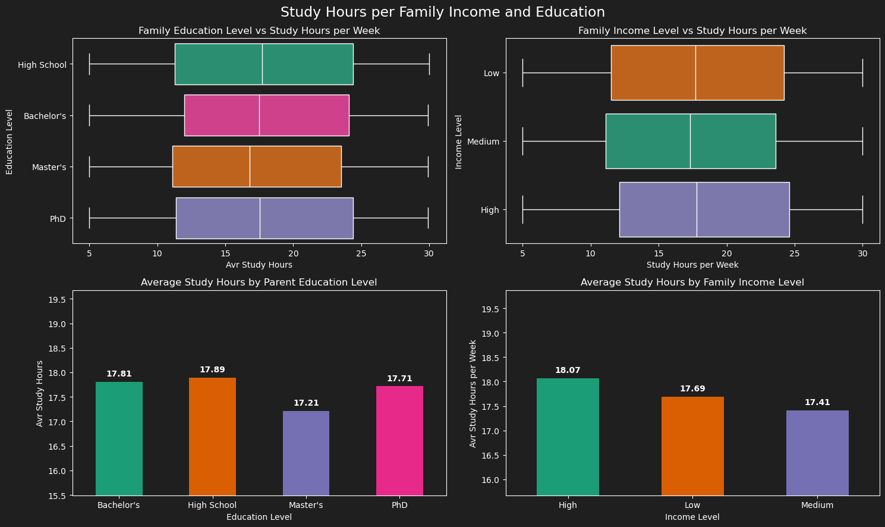
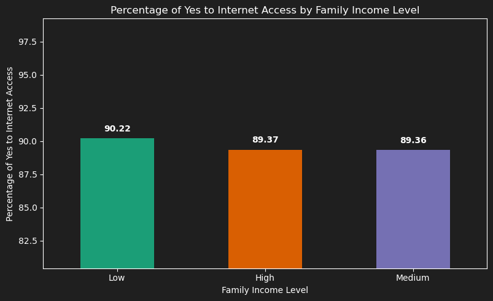 

---
# Lifestyle:

## Stress, Sleep, and Study:

### - How do stress, sleepm and study levels affect students' academic performance and attendance?

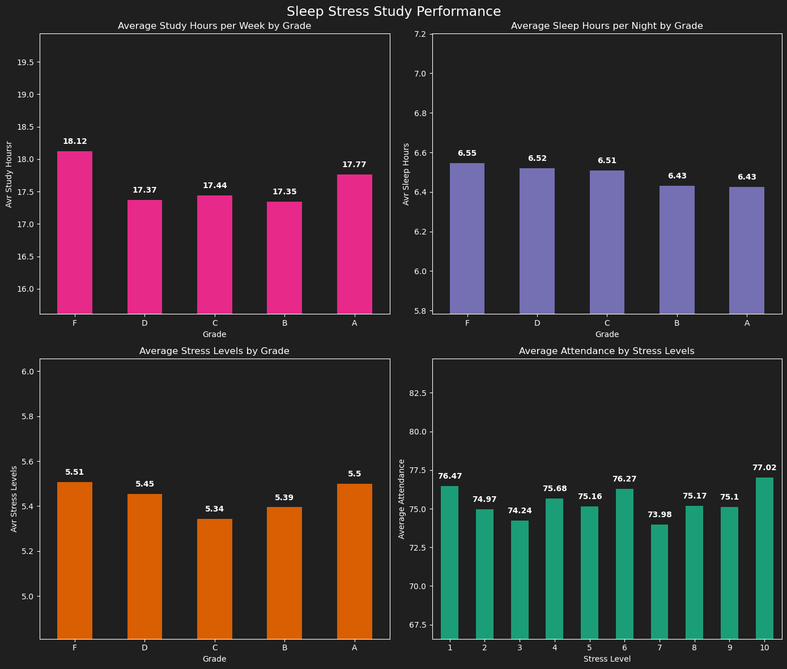
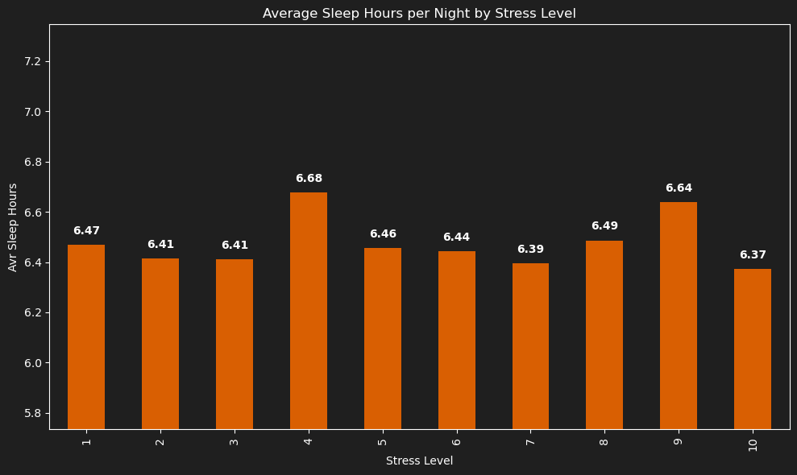 

---

## Extracurricular Activities and Academic Performance:

### - What is the impact of extracurricular participation on students' academics and lifestyle?
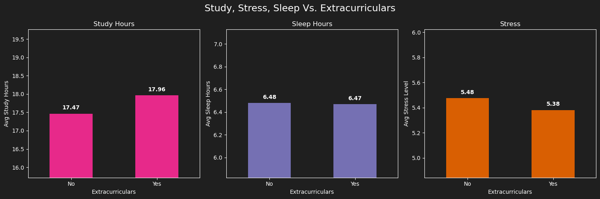
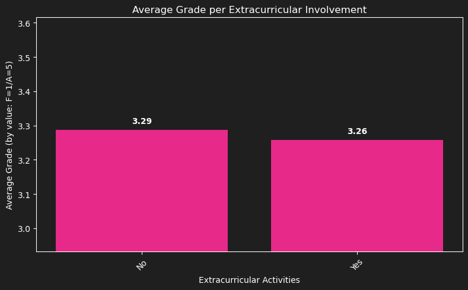 

---

## Attendance:

### - What impact does attendance have on students' academic performance?

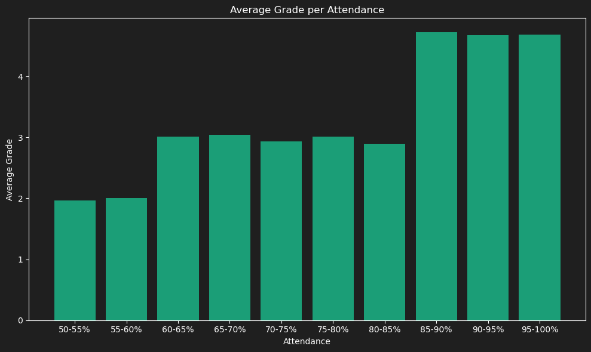 

# Conclusion

The largest factor in a Student's performance is their attendance record.

